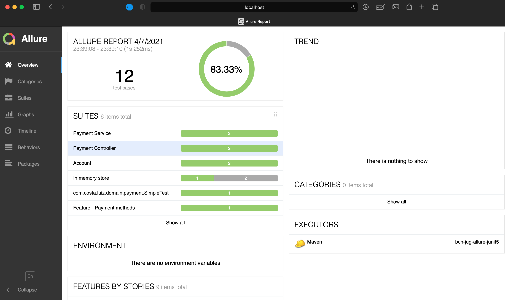

[Para español, haga clic aquí 🇪🇸](README_es.md)

# Project title
Test report using Allure and JUnit5

## Motivation
Share the experience using Allure

## Build status
[](https://github.com/luizgustavocosta/bcn-jug-allure-junit5/actions/workflows/bcn-jug-allure-junit5.yml)

## Quality Gate
[](https://sonarcloud.io/dashboard?id=luizgustavocosta_bcn-jug-allure-junit5)

## Tech/framework used
<b>Built with</b>
- [OpenJDK 11](https://openjdk.java.net/projects/jdk/11/)
- [JUnit5](https://junit.org/junit5/docs/current/user-guide/)
- [Allure](https://docs.qameta.io/allure/)

## Features
Payment

## Code Example
```java
@Feature("Payment")
class PaymentServiceTest {

    @Test
    @DisplayName("Debit and transfer funds")
    @Severity(SeverityLevel.BLOCKER)
    void debitAccountAndTransferFunds() {
        double amount = 42;

        service.debitAccountAndTransferFunds(buyer, seller, amount);

        verify(buyer, atLeastOnce()).balanceOperation(Operation.DEBIT, amount);
        verify(seller, atLeastOnce()).balanceOperation(Operation.CREDIT, amount);

    }

    @Test
    @DisplayName("Prepare for payment")
    @Severity(SeverityLevel.NORMAL)
    void prepareForPayment() {
        Throwable throwable =
                assertThrows(
                        UnsupportedOperationException.class,
                        () -> service.prepareForPayment());
        assertNull(throwable.getMessage());
    }
}
```

## Run locally
 - Download the project through the GitHub using
 ```git
 git clone https://github.com/luizgustavocosta/bcn-jug-allure-junit5.git
 ```
- Fix the failed test on InMemoryStoreTest class, if any.
 ```java
     @Test
     @Severity(SeverityLevel.TRIVIAL)
     void findAll() {
         assertNotNull(null);
     }
 ```
- Go to project folder 
```bash
cd bcn-jug-allure-junit5
```   
- And then execute
 ```maven
 mvn clean verify allure:serve
 ```
- A new page will be open showing the report

  

## References
* [Allure](https://docs.qameta.io/allure/)
* [Allure example](https://github.com/allure-examples/allure-junit5-example)
* [Payment domain](http://tfig.unece.org/contents/intro-domain-payment.htm)