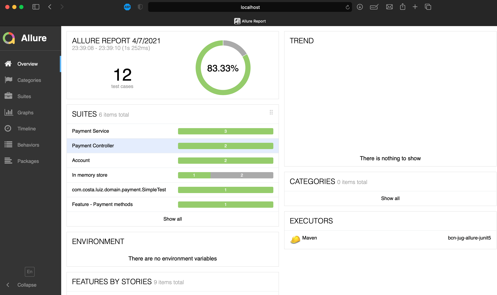

[For english, click here 🇬🇧](README.md)

# Título del Proyecto
Informes con Allure y JUnit5

## Motivación
Compartir la experiencia con Allure

## Build status
[](https://github.com/luizgustavocosta/bcn-jug-allure-junit5/actions/workflows/bcn-jug-allure-junit5.yml)

## Tech/framework used
<b>Construido con</b>
- [OpenJDK 11](https://openjdk.java.net/projects/jdk/11/)
- [JUnit5](https://junit.org/junit5/docs/current/user-guide/)
- [Allure](https://docs.qameta.io/allure/)

## Características
Pago

## Ejemplo
```java
@Feature("Payment")
class PaymentServiceTest {

    @Test
    @DisplayName("Debit and transfer funds")
    @Severity(SeverityLevel.BLOCKER)
    void debitAccountAndTransferFunds() {
        double amount = 42;

        service.debitAccountAndTransferFunds(buyer, seller, amount);

        verify(buyer, atLeastOnce()).balanceOperation(Operation.DEBIT, amount);
        verify(seller, atLeastOnce()).balanceOperation(Operation.CREDIT, amount);

    }

    @Test
    @DisplayName("Prepare for payment")
    @Severity(SeverityLevel.NORMAL)
    void prepareForPayment() {
        Throwable throwable =
                assertThrows(
                        UnsupportedOperationException.class,
                        () -> service.prepareForPayment());
        assertNull(throwable.getMessage());
    }
}
```

## Ejecutar localmente
 - Descarga el proyecto a través de GitHub usando
 ```git
 git clone https://github.com/luizgustavocosta/bcn-jug-allure-junit5.git
 ```
- Corrigir la prueba fallida en la classe InMemoryTest
 ```java
     @Test
     @Severity(SeverityLevel.TRIVIAL)
     void findAll() {
         assertNotNull(null);
     }
 ```
- Ir en la carpeta del proyecto
 ```bash
 cd bcn-jug-allure-junit5
 ```
 - Y luego ejecute
 ```maven
 mvn clean verify allure:serve
 ```
- Se abrirá una nueva página mostrando el informe.

  

## Referencias
* [Allure](https://docs.qameta.io/allure/)
* [Allure example](https://github.com/allure-examples/allure-junit5-example)
* [Payment domain](http://tfig.unece.org/contents/intro-domain-payment.htm)